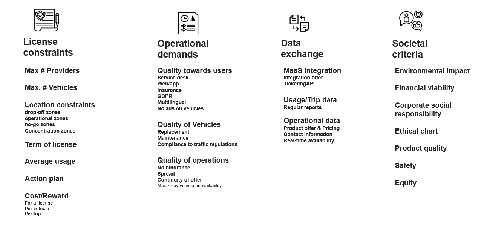

# About Common Shared Mobility License Framework

These pages are a first setup in the creating of a "universal" shared mobility licence framework. The goal of this framework is to create a tool for cities and regions that make it easy to define the parameters that could/should be implemented in their licensen. The framework for the moment is setup as a discussion document to find a common ground between legislation, private players and the public.

**Disclaimer:** The ideas in this document are just that, ideas. There still need to be done legal checks and operational checks before they can be implemented. 



## General Parameters

In order to provide context and a frame for the license model, several general parameters need to be defined.

```text
{ 
    "@context":"xxx", 
    "@type": "LicenseModel", 
    "name": "...", 
 } 
```

| Field | Type | Description | Example |
| :--- | :--- | :--- | :--- |
| `name` | String | Name of the license | Shared mobility license model for free floating bikes. |
| `description` | String | Description of the license model | This license model describes the requirements and criteria to operate a free floating bikes in the City of Antwerp |
| `zones` | String | Well Known Text \(WKT\) description of the areas that is covered by the license model | POLYGON\(\(4.676055908203124 50.88993205766312,4.723434448242187 50.89025691478409,4.72360610961914 50.86610302664647,4.675369262695312 50.86599468504889,4.676055908203124 50.88993205766312\)\) |
| `modality` | Enum | Modality Type: must-used modality of the route segment. | --&gt; ref OSLO Trip en Aanbod |
| `hasCriterionRequirement` | CriterionRequirement | Array of requirements |  |


## License Constraints

| Field | Type | Description | Example |
| :--- | :--- | :--- | :--- |
| maxProviders |  |  |  |
| maxVehicles |  |  |  |
| minVehicles |  |  |  |
| term |  | Duration of the license |  |
| avgUsage |  |  |  |

## Operational Demands

## Data Exchange

## Societal Criteria


